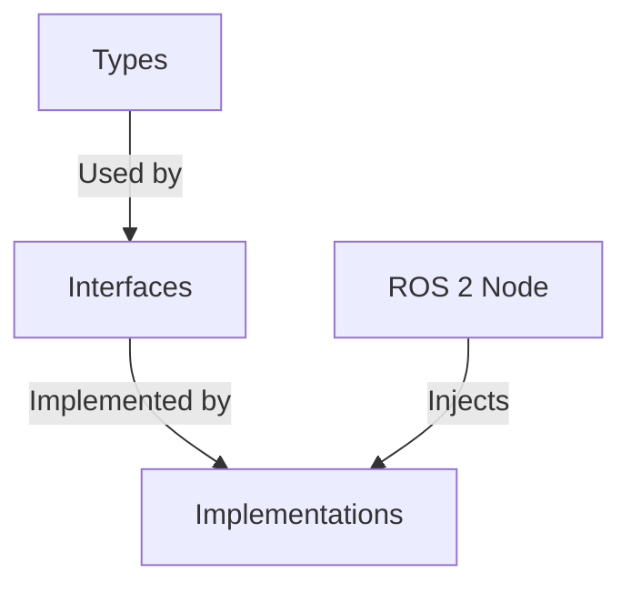

# The Cruiser

A C++ ROS 2 trajectory controller featuring custom implementations of Catmull-Rom Spline Smoothing and Trapezoidal Velocity Profiling.

This node intercepts discrete path plans (from Nav2 or other global planners), smooths them into continuous trajectories, and tracks them with PID control.

---

## Project Structure

The codebase is organized into three distinct layers to ensure modularity and testability:

    src/the_cruiser/
    ├── types/           # Data Structures (Points, Trajectories)
    ├── interfaces/      # Abstract Base Classes (Contracts)
    └── implementations/ # Concrete Logic (Algorithms)

**Dependency Graph:**



## Architecture

The system operates as a middleware controller in the standard ROS 2 Navigation stack.

    [Nav2 Global Planner] -- "/plan" --> [Cruiser Node]
    [Cruiser Node] -- "Smooths & Profiles" --> [PID Loop]
    [PID Loop] -- "/cmd_vel" --> [Robot Base]

---

## Installation

**Requirements:**
* ROS 2 Humble (Ubuntu 22.04)
* TurtleBot3 Simulation Package

### Build
```bash
colcon build --packages-select the_cruiser
source install/setup.bash
```

## Manual Startup (3 Terminals)

The Cruiser runs alongside Nav2. It intercepts plans from Nav2, smooths them, and controls the robot.

**Terminal 1: Gazebo**
```bash
export TURTLEBOT3_MODEL=waffle
ros2 launch turtlebot3_gazebo turtlebot3_world.launch.py
```

**Terminal 2: Nav2**
```bash
export TURTLEBOT3_MODEL=waffle
ros2 launch turtlebot3_navigation2 navigation2.launch.py \
  use_sim_time:=True \
  map:=/opt/ros/humble/share/turtlebot3_navigation2/map/map.yaml
```

**Terminal 3: Cruiser Controller**
```bash
source install/setup.bash
export TURTLEBOT3_MODEL=waffle
ros2 launch the_cruiser cruiser_standalone.launch.py
```

**Send a navigation goal in RViz.** Watch the robot follow the green smooth path.


---

## Testing

Unit tests cover input validation, spline math, and velocity boundary conditions.

    colcon test --packages-select the_cruiser --event-handlers console_direct+

**Coverage:**
* Input validation (empty paths, small waypoints)
* Spline math (4+ point interpolation)
* Velocity limits (kinematic constraints)
* Boundary conditions (start/stop safety)

---

## License
MIT License