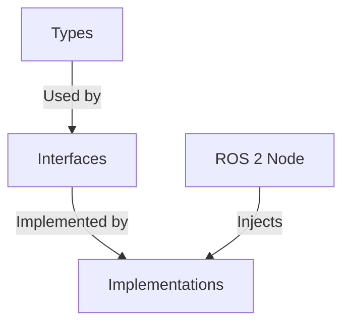

# The Cruiser

A C++ ROS 2 control stack featuring a **custom, from-scratch implementation** of Catmull-Rom Spline Smoothing and Trapezoidal Velocity Profiling.

Unlike standard wrappers, this project implements the core mathematical algorithms (geometric upsampling and kinematic constraints) without relying on external motion planning libraries.

This node intercepts discrete path plans (from global planners like Nav2) and generates continuous, differentiable trajectories.

This node intercepts discrete path plans (from global planners like Nav2 or Hybrid A*) and generates continuous, differentiable trajectories with kinematic constraints. It ensures smooth motion by preventing abrupt velocity changes at sharp corners.

---

## Project Structure

The codebase is organized into three distinct layers to ensure modularity and testability:

    src/the_cruiser/
    ├── types/           # Data Structures (Points, Trajectories)
    ├── interfaces/      # Abstract Base Classes (Contracts)
    └── implementations/ # Concrete Logic (Algorithms)

**Dependency Graph:**

## Architecture

The system operates as a middleware controller in the standard ROS 2 Navigation stack.

    [Nav2 Global Planner] -- "/plan" --> [Cruiser Node]
    [Cruiser Node] -- "Smooths & Profiles" --> [PID Loop]
    [PID Loop] -- "/cmd_vel" --> [Robot Base]

---

## Installation

**Requirements:**
* ROS 2 Humble (Ubuntu 22.04)
* TurtleBot3 Simulation Package

## 🚀 Quick Start (Automated)

### Setup Workspace
    mkdir -p ~/ros2_ws/src && cd ~/ros2_ws/src
    git clone https://github.com/info-dpv-intelligence/the_cruiser.git

### Run Master Demo Script
    cd ~/ros2_ws/src/the_cruiser
    chmod +x scripts/demo.sh
    ./scripts/demo.sh

*Note: This script detects your workspace, builds the package, sources the environment, and opens Gazebo/Nav2/Cruiser in separate tabs.*

## Usage

This package runs alongside the standard TurtleBot3 simulation. It requires the standard Nav2 stack for mapping/planning, but disables the default controller to execute its own trajectory logic.

### Manual Launch

**1. Launch Simulation**

    export TURTLEBOT3_MODEL=waffle
    ros2 launch turtlebot3_gazebo turtlebot3_world.launch.py

**2. Launch Navigation (Map & Planner)**

    export TURTLEBOT3_MODEL=waffle
    ros2 launch turtlebot3_navigation2 navigation2.launch.py \
      use_sim_time:=True \
      map:=/opt/ros/humble/share/turtlebot3_navigation2/map/map.yaml

**3. Start Controller**

    # IMPORTANT: Source the workspace overlay
    source ~/ros2_ws/install/setup.bash

    # Deactivate standard DWB controller
    ros2 lifecycle set /controller_server deactivate

    # Run The Cruiser
    ros2 run the_cruiser cruiser_node

---

## Testing

Unit tests cover input validation, spline math, and velocity boundary conditions.

    colcon test --packages-select the_cruiser --event-handlers console_direct+

**Test Coverage:**
* `RejectsEmptyInput`: Handles null/empty path vectors.
* `HandlesDuplicatePoints`: Prevents division-by-zero errors in time calculation.
* `RespectsVelocityLimits`: Verifies output velocities against `max_v` parameters.
* `StartsAndStopsAtZero`: Verifies boundary conditions for safe arrival.

---

## License
MIT License